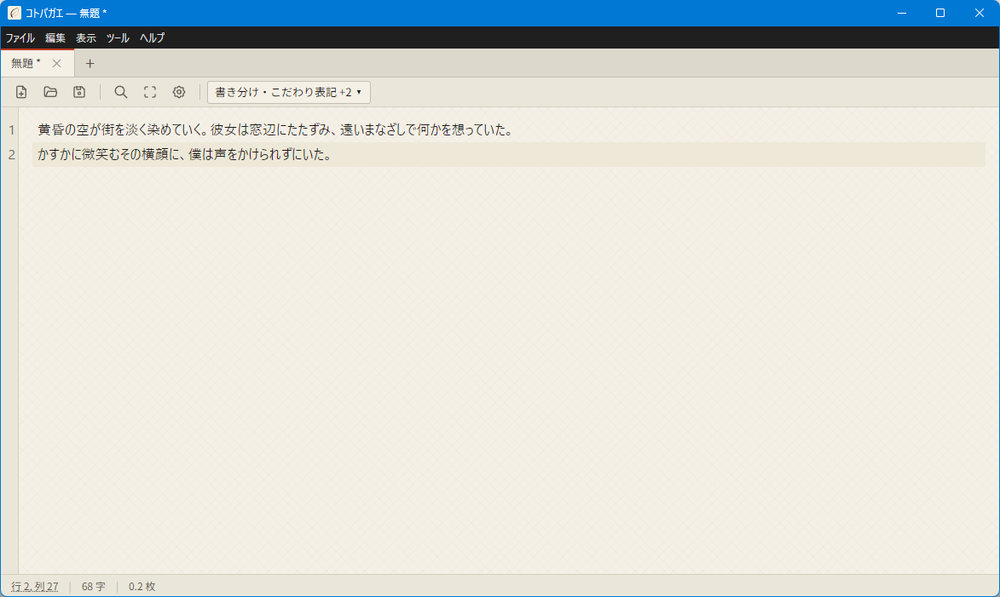
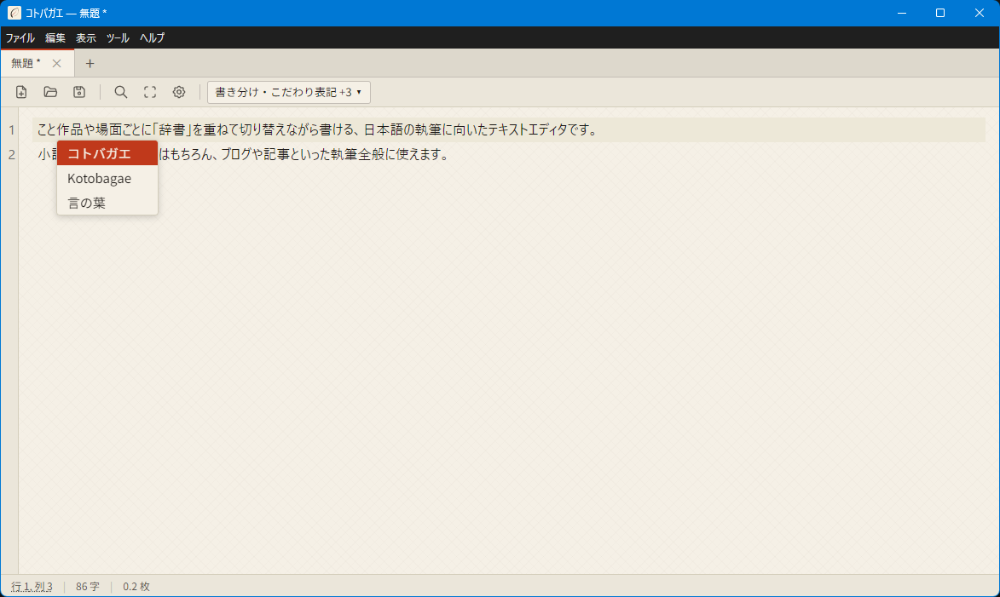
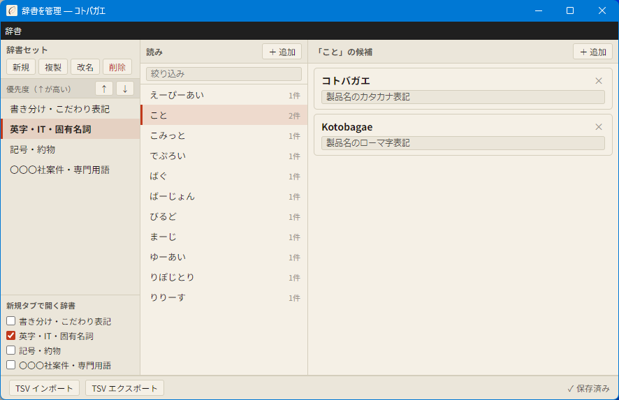

# コトバガエ（Kotobagae）

**複数の辞書を重ねて使い、切り替えられる執筆用テキストエディタ**

作品や場面ごとに「辞書」を重ねて切り替えながら書ける、日本語の執筆に向いたテキストエディタです。小説・脚本などの創作はもちろん、ブログや記事といった執筆全般に使えます。

---

## これは何？

「この作品ではこの言い回し」「この場面ではこの表記」——書き手それぞれのこだわりを **辞書** としてまとめ、作品ごとに切り替えたり、複数を重ねて使ったりできます。読みを入力すると候補がポップアップし、選ぶだけで置き換わります。

### 主な特徴

- **複数辞書の重ね掛け・切り替え**（最大5つ・優先度順にマージ）
- **読み → 候補の変換ポップアップ**
- **簡易・フルの辞書登録**（`Ctrl+D` / 右クリックから素早く登録）
- **4つのテーマ**（和紙・墨夜・ライト・ダーク）
- **複数タブ・セッション復元**（前回の続きから再開）
- **自動保存＆復元**
- **検索・置換／集中モード（F11）／原稿用紙換算** など

---

## 対応OS

- **Windows 10 / 11**（64bit）
- **macOS 11（Big Sur）以降**（Intel / Apple Silicon 両対応）

---

## ダウンロード / インストール

**[▶ 最新版のダウンロード（GitHub Releases）](https://github.com/hex2bkap/kotobagae/releases/latest)**

### Windows

- **インストーラ版**：`Kotobagae-Setup-1.0.0-x64.exe` を実行してインストール。
- **ポータブル版**：`Kotobagae-1.0.0-x64-portable.zip` を解凍してそのまま起動（USB メモリ等でも可）。

> **SmartScreen の警告が出たら**：このアプリには署名がないため、初回に警告が出ることがあります。「詳細情報」→「実行」で起動できます。

### macOS

1. `.dmg` を開きます。
2. 中の **`Kotobagae`** を「アプリケーション」フォルダへドラッグします。
3. **初回だけ**、アプリを **右クリック →「開く」** で起動してください（署名がないため、ダブルクリックでは開けないことがあります）。

> アプリ内の表示やウィンドウのタイトルは「コトバガエ」です（Finder・Dock・メニューバーなど macOS の表示のみ英字 `Kotobagae` になります）。

---

## 基本的な使い方

- **書く・開く・保存**：文字コードは自動判定して開きます。複数タブで並行して開けます。
- **自動保存と復元**：編集中の内容は自動保存され、次回起動時に復元できます。

> **Mac をお使いの方へ**
> - ショートカットの `Ctrl` は `Cmd` に読み替えてください。
> - ファイルは **「ファイル → 開く」（`Cmd+O`）** から開いてください（`.txt` のダブルクリック関連付けは macOS の仕様で定着しないことがあります）。
> - `F11` は macOS の機能（Show Desktop）と重なるため、**集中モードはツールバーのボタン、または「表示」メニューから**切り替えてください（`Esc` でも終了できます）。

### 辞書の作り方・使い方

読みを入力すると、登録した候補がポップアップします。たとえば **読み「こと」→ 候補「コトバガエ」** と登録しておけば、「こと」と打つだけで「コトバガエ」に変換できます。

登録には2つの方法があります。

- **本文からすぐに（簡易登録）**：本文中の語を選んで `Ctrl+D`、または右クリック →「辞書に登録」。選んだ語が候補になり、読みを入れるだけで登録できます。
- **辞書管理ウィンドウから（フル登録）**：「読み」「候補」を入力して登録・編集します（1つの読みに複数の候補、メモも付けられます）。

> 辞書は **`TSV` 形式で取り込み・書き出し**できます（他の IME 辞書との受け渡しにも）。**サンプル辞書**（記号・約物／英字・IT・固有名詞／書き分け）を「取り込み」から読み込めば、“辞書を重ねる”感覚をすぐ試せます。

### 複数辞書を重ねて切り替える

**辞書は用途ごとに小さく分けておくと便利です。** たとえば「人名」「地名」「ジャンル用語」のように分けておき、書くものに合わせて重ねたり、オン・オフを切り替えたりできます。使い回せる辞書（ジャンル用語など）は、次の作品にもそのまま持ち越せます。

- ツールバーの辞書セレクタから、使う辞書を選びます。
- **最大5つ**まで重ねられ、**優先度順**に候補がマージされます。

### 表示・その他

- テーマ（和紙・墨夜・ライト・ダーク）、フォント、集中モード（`F11`）を切り替えられます。

### もっと詳しく

ここで触れていない機能も、メニュー・設定・ツールバーから見つけられます（ショートカット一覧は「ヘルプ」から）。

---

## データの保存場所

辞書・設定・セッションは次の場所に保存されます。

- **Windows**：`%APPDATA%\kotobagae`
- **macOS**：`~/Library/Application Support/kotobagae`

**ポータブルモード**：実行ファイル（アプリ）と同じフォルダに `portable.txt` を置くと、そのフォルダ内にデータを保存します。

> **アンインストールしても、このデータは削除されません。** あなたの辞書や設定を失わないための仕様です。

---

## 更新方法

自動更新機能はありません。新しいインストーラ / zip / dmg に入れ替えることで更新します。上記のデータフォルダは引き継がれるため、辞書や設定はそのまま残ります。

---

## よくある質問（FAQ）

**Q. 外部で削除したファイルを編集して保存したら、元の場所に復活しました。**
A. あなたの編集内容を失わないための想定挙動です。編集中のファイルが外部で消えても、保存すると元のパスに再作成されます。

**Q. 古い形式の辞書は使えますか？**
A. 初回読み込み時に自動で新しい形式へ変換します（元ファイルは `.bak` として残します）。

**Q. 起動時に「SmartScreen」「Gatekeeper」の警告が出ます。**
A. このアプリには署名がないためです。上の「ダウンロード / インストール」の手順で回避できます。

**Q.（Mac）.txt をダブルクリックしてもコトバガエで開きません／「常にこのアプリケーションで開く」にしても戻ってしまいます。**
A. 署名のないアプリを"既定のアプリ"として固定できない、という macOS 側の仕様によるものです。コトバガエで開くときは、アプリを起動して **「ファイル → 開く」（`Cmd+O`）** からファイルを選んでください。（Windows ではダブルクリックでの関連付けが使えます。）

**Q. 辞書や設定はどこに保存されますか？**
A. 上の「データの保存場所」をご覧ください。

---

## 利用条件・免責

- 本ソフトウェアは **無償** で提供され、**無保証（AS IS）** です。利用は自己責任でお願いします。本ソフトウェアの使用によって生じたいかなる損害についても、作者は責任を負いません。
- **再配布について**：現時点では、本ソフトウェアの再配布・改変しての配布はご遠慮ください。配布は公式の入手先からのみとさせてください。
- ソースコードは非公開です。外部からのコントリビューションは当面受け付けていません。

---

## 作者 / 連絡先

- 作者：**hex2bkap**
- **不具合の報告・ご要望**：[GitHub の Issue](https://github.com/hex2bkap/kotobagae/issues) へお願いします。
- **X（旧Twitter）**：[@hex2bkap](https://x.com/hex2bkap)
